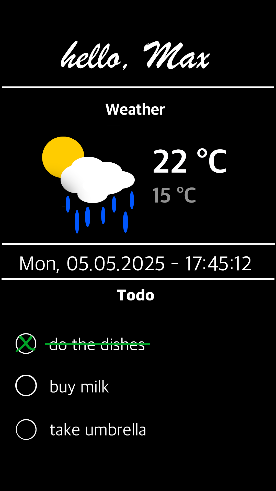

# MirrorApp

This app is the entry point for an embedded device to display certain things like the weather at the selected location, todos and maybe more later on. To change the location and add / delete todos, an app will be provided.

## Requirements

> sudo apt install libgles2-mesa-dev \\\
> libx11-dev \\\
> libxcursor-dev \\\
> libxrandx-dev \\\
> libxi-dev \\\
> libxinerama-dev \\\
> libgl-dev

## Execute

> go build \
> ./mirrorApp

Later this will be started with the init of the os

## Design Idea

